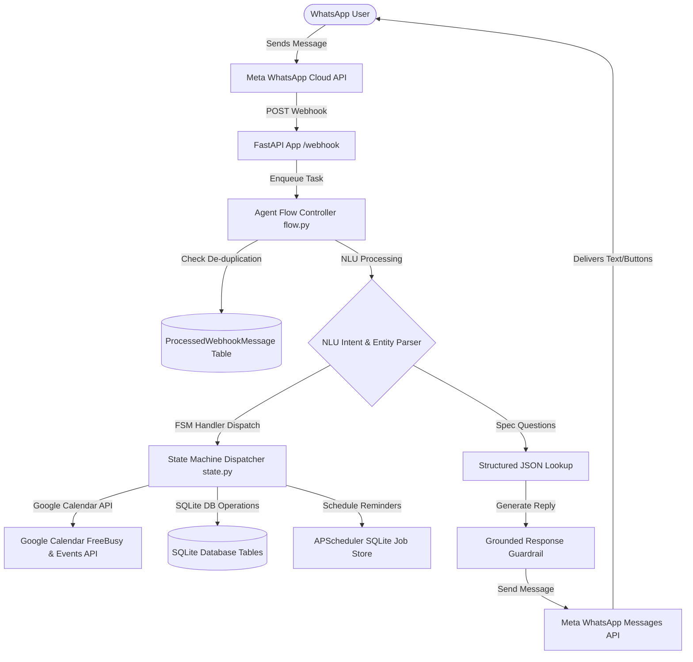
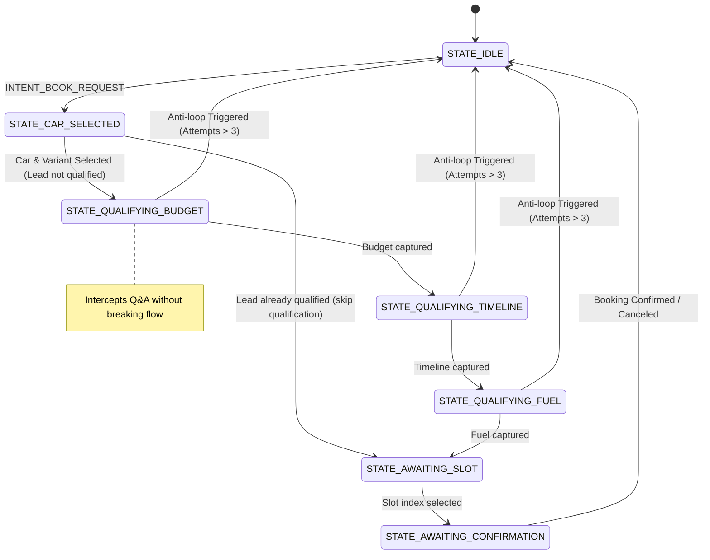

# CarBOLO WhatsApp AI Agent

Production-ready AI-powered WhatsApp dealership assistant with:

- Grounded RAG knowledge retrieval
- Google Calendar booking integration
- APScheduler reminder orchestration
- FSM conversational workflows
- Hinglish support
- Reschedule & cancellation flows
- Anti-hallucination guardrails
- Restart-safe reminder recovery


---


## 🛡️ Production Safety Guarantees

Unlike traditional prompt-only chatbots, CarBOLO enforces strict backend constraints to ensure enterprise-grade reliability and security:

* **Webhook De-duplication**: Protects against Meta webhook retry storms. Incoming message IDs are registered in the `processed_webhook_messages` table; duplicate requests are immediately dropped (200 OK) without re-running state transitions.
* **Transaction-Scoped Write Protection**: Employs SQLite transactional write-serialization semantics (`BEGIN IMMEDIATE` transaction execution via SQLAlchemy). Even if simultaneous confirms are received, the database locks the write stream, forcing sequential evaluation and preventing double bookings.
* **Zero-Hallucination Interception**: Uses a post-processing guardrail layer. If the LLM generates a response claiming features that are absent from the retrieved JSON specifications (e.g. ADAS for Swift, sunroof for Brezza VXi), it is instantly replaced with a strict fallback: *"I don't have that information in the dealership knowledge base. I will check with the team."*
* **Slot Expiration Holds**: Selected slots are reserved for exactly 10 minutes (`slot_generated_at`). Confirmations received after this hold has expired are rejected, and fresh slots are generated.
* **Session Timeout Cleanup**: Stale conversation states are reset to `STATE_IDLE` after 30 minutes of user inactivity.
* **Scheduler Restart Recovery**: Reminders are persisted in SQLite. On system reboot, all future pending reminders are reloaded and rescheduled in `APScheduler`.
* **Automatic Retry Backoff**: If WhatsApp API dispatch fails, the scheduler retries transmission in 5-minute increments (up to 3 attempts) before marking the reminder as failed.
* **Anti-loop Protection**: During qualification, if the user sends 4 consecutive invalid/unrecognized inputs, the agent automatically resets to `STATE_IDLE` and schedules a dealer representative callback to prevent infinite loops.

---

## 🏗️ Architecture



### Conversational State Machine (FSM)



---

## 🛠️ Tech Choices & Design Decisions

### 1. Modular State-Handler Architecture
Instead of utilizing nested, hard-to-maintain `if-else` blocks inside a single transition function, the FSM uses a dispatcher dictionary (`STATE_HANDLERS`) linking conversation states to specialized handler functions:
* `STATE_IDLE` -> `handle_idle`
* `STATE_CAR_SELECTED` -> `handle_car_selected`
* `STATE_QUALIFYING_BUDGET` -> `handle_qualifying_budget`
* `STATE_QUALIFYING_TIMELINE` -> `handle_qualifying_timeline`
* `STATE_QUALIFYING_FUEL` -> `handle_qualifying_fuel`
* `STATE_AWAITING_SLOT` -> `handle_awaiting_slot`
* `STATE_AWAITING_CONFIRMATION` -> `handle_awaiting_confirmation`

### 2. Conversational Interruption & Resumption
During lead qualification states, if a user interrupts with a question about car specifications (classified as `INTENT_QA` with spec keywords like "sunroof", "mileage", etc.), the agent intercepts it, retrieves the grounded catalog specs, answers the user, and immediately appends the qualification prompt to resume the flow.

### 3. Dynamic Qualification Parameter Skipping
If a user specifies their preference early (e.g. `"I want a test drive of Maruti Ertiga VXi petrol under 10L"`), the parser extracts `budget` and `fuel_preference` entities and stores them, skipping those questions dynamically when the qualification FSM begins.

### 4. Booking Versioning & API Cleanup
* **Audit Trail**: Cancellations mark the DB record status as `CANCELLED` and reschedule actions mark them as `RESCHEDULED` rather than physically deleting rows, maintaining a clean audit trail. When a reschedule is confirmed, a new version of the booking is inserted as a fresh database row.
* **API Resource Cleanup**: Rescheduling or cancelling immediately makes an API call to delete the event from Google Calendar and removes the pending date-trigger reminder jobs from APScheduler.

---

## 📂 Project Structure

```
carbolo-agent/
│
├── app/
│   ├── main.py             # FastAPI App Shell (Lifespan & Scheduler initialization)
│   ├── webhook.py          # Deprecated forwarder (for backward compatibility)
│   │
│   ├── agent/
│   │   ├── intent.py       # Heuristics + Gemini Hybrid Intent NLU
│   │   ├── state.py        # FSM state handlers dispatcher & transitions
│   │   └── flow.py         # Main webhook routing workflow orchestration
│   │
│   ├── calendar/
│   │   ├── availability.py # IST available slot generator using FreeBusy
│   │   ├── booking.py      # Double-booking guard + Calendar insert/delete
│   │   └── google_client.py# Service account client with Mock fallback
│   │
│   ├── db/
│   │   ├── models.py       # SQLAlchemy schemas
│   │   └── session.py      # Async Engine & Sessionmaker
│   │
│   ├── rag/
│   │   ├── kb_loader.py    # Structured JSON file reader
│   │   ├── retriever.py    # Local keyword-based retriever
│   │   └── prompt.py       # Grounding instructions for Gemini
│   │
│   ├── scheduler/
│   │   └── reminders.py    # APScheduler workers, SQLite loader & cancels
│   │
│   └── whatsapp/
│       ├── main.py         # WhatsApp package entry point
│       ├── webhook.py      # GET/POST endpoints for WhatsApp webhooks
│       ├── send_message.py # Exposes WhatsApp sender helpers
│       ├── sender.py       # Text & Interactive reply buttons dispatch
│       └── parser.py       # Meta Webhook payload extractor
│
├── data/
│   └── cars.json           # Catalog of Maruti Brezza, Swift, & Ertiga
│
├── tests/
│   └── test_agent.py       # Unit and Integration test suite (14 test cases)
│
├── Dockerfile              # Multi-stage Docker production deployment
├── requirements.txt        # Backend dependencies
├── .env                    # Active application environment variables
└── README.md
```

---

## 🛠️ API & Credential Configuration

Create a `.env` file in the root directory:

```env
# Server details
PORT=8000
HOST=0.0.0.0

# Gemini API key (for Hinglish/English NLU & Grounded Q&A)
GEMINI_API_KEY=your_gemini_api_key

# Meta Developer Credentials
WHATSAPP_PHONE_NUMBER_ID=your_phone_number_id
WHATSAPP_ACCESS_TOKEN=your_access_token
WHATSAPP_VERIFY_TOKEN=your_custom_verify_token_string

# Google Calendar Credentials
GOOGLE_SERVICE_ACCOUNT_JSON={"type": "service_account", "project_id": ...}
GOOGLE_CALENDAR_ID=your_dealership_calendar_id@group.calendar.google.com
```

### Mock Mode Fallback
If any credential variable is left as a mock placeholder, the application runs in a local **Mock Mode**:
* Outgoing WhatsApp messages and reply buttons are printed to stdout logs (including typing simulations).
* Google Calendar events are held in memory.
* NLU intent classification runs on robust local keyword heuristics.
* **This allows testing the complete booking flow, scheduler, and restart recovery locally without any external setup!**

---

## 🚀 Execution & Verification

### Running the App Locally
1. Install dependencies:
   ```bash
   pip install -r requirements.txt
   ```
2. Start the FastAPI server:
   ```bash
   python -m uvicorn app.main:app --reload
   ```

### Running Automated Tests
The test suite validates:
* Context lookup & Hallucination post-processing guardrails
* FSM Intent classification (including cancel overrides)
* Webhook de-duplication
* Test-drive booking transaction safety & Idempotency
* Session timeout cleanup
* Slot hold expiration rules
* Cancel completed bookings & disable reminders
* Scheduler reload recovery from SQLite
* Lead qualification step progression & skip rules
* Q&A Interruption mid-qualification
* Anti-loop safety abort checks
* Returning user greeting welcomes
* Reschedule flow database status updates, reminder cancel actions, and Google Calendar event deletions.

Run the tests with:
```bash
pytest tests/
```

---

## 🌟 Walkthrough & Evaluation Demo Script

Here is a 2-minute step-by-step demo flow that highlights the major features of the system. You can test it by messaging the live WhatsApp number:

### Step 1: Grounded Specs & Hinglish Query
* **User sends**: `"Hi, Brezza VXi me sunroof hai kya?"`
* **Agent replies**: `"The Maruti Brezza VXi variant does not come with a sunroof. The sunroof is available on the ZXi+ variant."`
* *Verification*: RAG context lookup matches specs correctly. Post-processing prevents the model from hallucinating features.

### Step 2: Out-of-KB Refusal Check
* **User sends**: `"Does the Brezza VXi have ADAS safety specs?"`
* **Agent replies**: `"I don't have that information in the dealership knowledge base."`
* *Verification*: Strict post-processing guardrail rejects ungrounded feature claims.

### Step 3: Initiate Booking & Lead Qualification
* **User sends**: `"vxi theek hai, drive book kar do parso"`
* **Agent replies**: `"Awesome choice! Before we select a slot for your test drive of the Maruti Suzuki Brezza (VXi), could you tell us what your approximate budget is?"`
* *Verification*: FSM transitions: `STATE_IDLE` -> `STATE_CAR_SELECTED` -> `STATE_QUALIFYING_BUDGET`. Interprets Hinglish words and date reference.

### Step 4: Q&A Interruption mid-qualification
* **User sends**: `"12L ke around... but Ertiga VXi me dual AC vents hain?"`
* **Agent replies**: `"Yes, the Maruti Ertiga VXi comes with rear AC vents. \n\nTo continue with scheduling, when are you looking to purchase the vehicle? (e.g., immediate, within a month, or just researching?)"`
* *Verification*: Intercepts Q&A, answers correctly using RAG, and resumes budget progression by transitioning to `STATE_QUALIFYING_TIMELINE`.

### Step 5: Complete Qualification & Propose Slots
* **User sends**: `"immediate"` (timelines capture)
* **Agent replies**: `"Understood. Lastly, what is your preferred fuel type? (Petrol, Diesel, CNG, or Hybrid?)"`
* **User sends**: `"CNG"` (fuel capture)
* **Agent replies**: Generates 3 available slots for the requested date preference using interactive WhatsApp buttons.
* *Verification*: FSM transitions to `STATE_AWAITING_SLOT` and posts buttons.

### Step 6: Select Slot & Confirm
* **User selects**: Option 2 (e.g. `"Tue 11:00 AM"`)
* **Agent replies**: Send confirmation buttons: `"Reply CONFIRM to book..."`
* **User sends**: `"CONFIRM"`
* **Agent replies**: `"Done ✅ Test drive booked - Maruti Brezza VXi, Tuesday 11:00 AM. I'll remind you a day before and 2 hours before."`
* *Verification*: Writes to Google Calendar, creates SQLite record, and schedules APScheduler reminder jobs.

### Step 7: Reschedule Flow
* **User sends**: `"reschedule booking"`
* **Agent replies**: Marks the old booking as `RESCHEDULED`, deletes it from Google Calendar, cancels reminders, and immediately responds with a fresh set of slots for the Brezza VXi.
* *Verification*: API cancellation triggered, scheduler jobs removed, database versioning applied, FSM transitions to slot choice.

### Step 8: Cancellation Flow
* **User sends**: `"cancel booking"`
* **Agent replies**: `"Your test drive for Maruti Suzuki Brezza has been successfully cancelled and reminders have been turned off."`
* *Verification*: Cleans up Google Calendar events and SQLite reminders.

### Step 9: Returning User Greeting
* **User sends**: `"Hi"`
* **Agent replies**: `"Welcome back, [Customer Name]! Great to chat with you again at Maruti Suzuki Dealership. How can I assist you today?..."`
* *Verification*: Retrieval of historical database booking records to customize greets dynamically.
