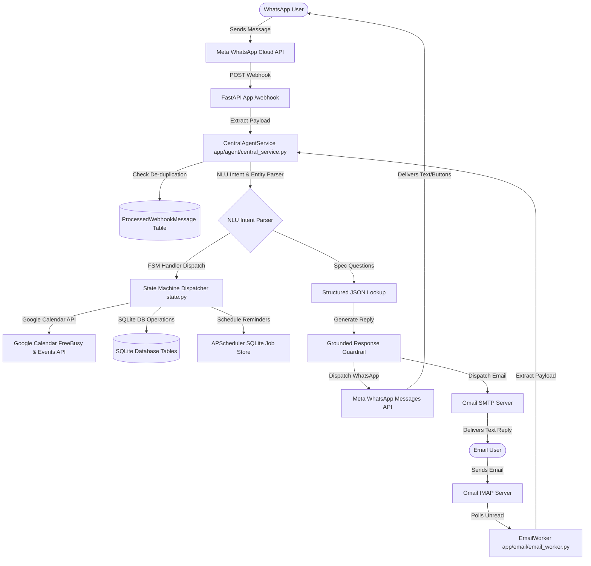
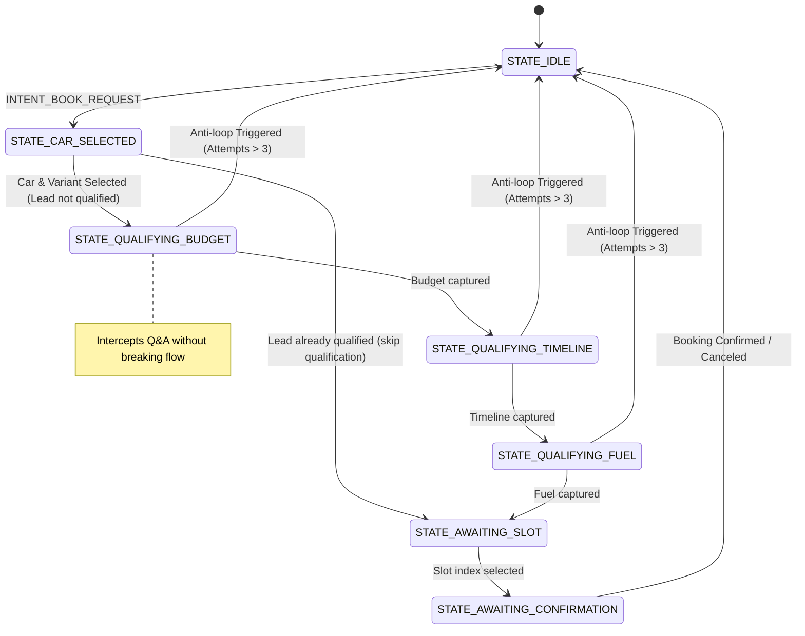

# CarBOLO Multi-Channel AI Agent (WhatsApp & Gmail)

Production-ready, multi-channel AI-powered dealership assistant supporting both **WhatsApp** and **Gmail** channels with:

- **Unified Agent Core**: Shared NLU, grounded RAG knowledge retrieval, and FSM conversational state machine.
- **Google Calendar Booking Integration**: Live schedule availability checks and event creation/cancellation.
- **APScheduler Reminder Orchestration**: Automated reminder delivery, cancel handles, and restart recovery.
- **Interactive Multi-Channel Formats**: Native interactive buttons on WhatsApp, and automatically formatted numbered lists on Gmail.
- **Robust SQLite Concurrency**: Custom connection settings resolving database lockups under high concurrency.
- **Anti-Spam & Safeguard Layers**: Hard allowlists and header-based spam interceptors for email.


---

## 🛡️ Production Safety Guarantees

Unlike traditional prompt-only chatbots, CarBOLO enforces strict backend constraints to ensure enterprise-grade reliability and security:

* **Webhook De-duplication**: Protects against Meta webhook retry storms. Incoming message IDs are registered in the `processed_webhook_messages` table; duplicate requests are immediately dropped (200 OK) without re-running state transitions.
* **SQLite Concurrency & WAL mode**: Solves database write lockups (`database is locked` error) under simultaneous WhatsApp and Email requests by using `NullPool` (isolated connections under `aiosqlite`) coupled with Write-Ahead Logging (`PRAGMA journal_mode=WAL`), `PRAGMA synchronous=NORMAL`, and a `busy_timeout` of 30,000ms.
* **Gmail Sender Allowlist Guard**: The email worker strictly processes emails from defined allowlist addresses (e.g. `carboloagent@gmail.com`). Unauthorized senders are blocked immediately, safeguarding Gemini API quota.
* **Automated Spam & Bounce Filters**: Email worker scans headers (`List-Unsubscribe`, `Auto-Submitted`, `Precedence`) and flags subject keywords (`mailer-daemon`, `job`, `newsletter`, `career`) to prevent infinite looping with auto-replies or bounce messages.
* **Zero-Hallucination Interception**: Uses a post-processing guardrail layer. If the LLM generates a response claiming features that are absent from the retrieved JSON specifications (e.g. ADAS for Swift, sunroof for Brezza VXi), it is instantly replaced with a strict fallback: *"I don't have that information in the dealership knowledge base."*
* **Slot Expiration Holds**: Selected slots are reserved for exactly 10 minutes (`slot_generated_at`). Confirmations received after this hold has expired are rejected, and fresh slots are generated.
* **Session Timeout Cleanup**: Stale conversation states are reset to `STATE_IDLE` after 30 minutes of user inactivity.
* **Scheduler Restart Recovery**: Reminders are persisted in SQLite. On system reboot, all future pending reminders are reloaded and rescheduled in `APScheduler`.
* **Automatic Retry Backoff**: If WhatsApp API dispatch fails, the scheduler retries transmission in 5-minute increments (up to 3 attempts) before marking the reminder as failed.
* **Anti-loop Protection**: During qualification, if the user sends 4 consecutive invalid/unrecognized inputs, the agent automatically resets to `STATE_IDLE` and schedules a dealer representative callback to prevent infinite loops.

---

## 🏗️ Architecture



### Conversational State Machine (FSM)



---

## 🛠️ Tech Choices & Design Decisions

### 1. Unified Agent Engine (`CentralAgentService`)
Instead of duplicating FSM handlers and RAG retrieval libraries across transport protocols, both WhatsApp webhooks and Gmail background threads delegate parsing to `CentralAgentService`. This ensures state management, NLU, and calendar logic remain identical.

### 2. Channel-Specific Layouts
* **WhatsApp**: Dispatches native text and interactive buttons (choices, confirmation actions).
* **Gmail**: Formats interactive components dynamically into plaintext layouts (e.g. converting buttons to numbered, line-by-line options: `1. Thu 9:00 AM`, etc.).

### 3. Modular State-Handler Architecture
Conversations use a dispatcher dictionary (`STATE_HANDLERS`) linking conversation states to specialized handler functions (`app/agent/state.py`).

### 4. Conversational Interruption & Resumption
Users can ask catalog questions (e.g. sunroof details) in the middle of lead qualification. The system answers the question using RAG and automatically appends the qualification prompt to keep the booking flow going.

---

## 📂 Project Structure

```
carbolo-agent/
│
├── app/
│   ├── main.py             # FastAPI App Shell (Lifespan, WhatsApp webhook, & Gmail worker)
│   ├── webhook.py          # Deprecated forwarder (for backward compatibility)
│   │
│   ├── agent/
│   │   ├── central_service.py # Central entry point routing WhatsApp and Gmail inputs
│   │   ├── intent.py       # Heuristics + Gemini Hybrid Intent NLU
│   │   ├── state.py        # FSM state handlers dispatcher & transitions
│   │   └── flow.py         # WhatsApp webhook workflow orchestration
│   │
│   ├── email/
│   │   ├── email_worker.py # Background loop polling IMAP and triggering replies
│   │   └── gmail_service.py# IMAP/SMTP message fetching, sending & spam filters
│   │
│   ├── calendar/
│   │   ├── availability.py # IST available slot generator using FreeBusy
│   │   ├── booking.py      # Double-booking guard + Calendar insert/delete
│   │   └── google_client.py# Service account client with Mock fallback
│   │
│   ├── db/
│   │   ├── models.py       # SQLAlchemy schemas
│   │   └── session.py      # Async Engine & Sessionmaker (WAL mode config)
│   │
│   ├── rag/
│   │   ├── kb_loader.py    # Structured JSON file reader
│   │   ├── retriever.py    # Local keyword-based retriever
│   │   └── prompt.py       # Grounding instructions for Gemini
│   │
│   ├── scheduler/
│   │   └── reminders.py    # APScheduler workers, SQLite loader & cancels
│   │
│   └── whatsapp/
│       ├── main.py         # WhatsApp package entry point
│       ├── webhook.py      # GET/POST endpoints for WhatsApp webhooks
│       ├── send_message.py # Exposes WhatsApp sender helpers
│       ├── sender.py       # Text & Interactive reply buttons dispatch
│       └── parser.py       # Meta Webhook payload extractor
│
├── data/
│   └── cars.json           # Catalog of Maruti Brezza, Swift, & Ertiga
│
├── tests/
│   ├── test_agent.py       # Unit and Integration test suite (14 test cases)
│   └── test_central_service.py # Multi-channel and central agent tests
│
├── Dockerfile              # Multi-stage Docker production deployment
├── requirements.txt        # Backend dependencies
├── .env                    # Active application environment variables
├── e2e_test.py             # End-to-end validation test suite
└── README.md
```

---

## 🛠️ API & Credential Configuration

Create a `.env` file in the root directory:

```env
# Server details
PORT=8000
HOST=0.0.0.0

# Gemini API key (for Hinglish/English NLU & Grounded Q&A)
GEMINI_API_KEY=your_gemini_api_key

# Meta Developer Credentials (WhatsApp)
WHATSAPP_PHONE_NUMBER_ID=your_phone_number_id
WHATSAPP_ACCESS_TOKEN=your_access_token
WHATSAPP_VERIFY_TOKEN=your_custom_verify_token_string

# Gmail Service Credentials
GMAIL_ADDRESS=your_dealership_gmail@gmail.com
GMAIL_APP_PASSWORD=your_gmail_app_password

# Google Calendar Credentials
GOOGLE_SERVICE_ACCOUNT_JSON={"type": "service_account", "project_id": ...}
GOOGLE_CALENDAR_ID=your_dealership_calendar_id@group.calendar.google.com
```

### Mock Mode Fallback
If any credential variable is left as a mock placeholder, the application runs in a local **Mock Mode**:
* Outgoing WhatsApp messages and reply buttons are printed to stdout logs.
* Google Calendar events are held in memory.
* NLU intent classification runs on local keyword heuristics.
* **Allows testing the complete booking flow, scheduler, and restart recovery locally without external setup!**

---

## 🚀 Execution & Verification

### Running the App Locally
1. Install dependencies:
   ```bash
   pip install -r requirements.txt
   ```
2. Start the FastAPI server (which automatically boots the background Gmail worker):
   ```bash
   python -m uvicorn app.main:app
   ```

### Running Automated Unit/Integration Tests
Run pytest tests:
```bash
pytest tests/
```

### Running the E2E Simulation Suite
We provide an interactive/automated end-to-end script that validates the entire stack (Server Health, GET Verify, WhatsApp NLU, qualification, slots, confirmations, Gmail email processing, and logging health). Run the simulation with:
```bash
python e2e_test.py
```

---

## 🌟 Walkthrough & Evaluation Demo Script

Here is a demo flow highlighting the major features of the system. You can test it on either **WhatsApp** or by sending an email from your configured allowlist address to the registered **Gmail address**:

### Step 1: Grounded Specs & Hinglish Query
* **User sends (WhatsApp/Gmail)**: `"Hi, Brezza VXi me sunroof hai kya?"`
* **Agent replies**: `"The Maruti Brezza VXi variant does not come with a sunroof. The sunroof is available on the ZXi+ variant."`
* *Verification*: RAG context lookup matches specs correctly. Post-processing prevents the model from hallucinating features.

### Step 2: Out-of-KB Refusal Check
* **User sends**: `"Does the Brezza VXi have ADAS safety specs?"`
* **Agent replies**: `"I don't have that information in the dealership knowledge base."`
* *Verification*: Strict post-processing guardrail rejects ungrounded feature claims.

### Step 3: Initiate Booking & Lead Qualification
* **User sends**: `"vxi theek hai, drive book kar do parso"`
* **Agent replies**: `"Awesome choice! Before we select a slot for your test drive of the Maruti Suzuki Brezza (VXi), could you tell us what your approximate budget is?"`
* *Verification*: FSM transitions: `STATE_IDLE` -> `STATE_CAR_SELECTED` -> `STATE_QUALIFYING_BUDGET`.

### Step 4: Q&A Interruption mid-qualification
* **User sends**: `"12L ke around... but Ertiga VXi me dual AC vents hain?"`
* **Agent replies**: `"Yes, the Maruti Ertiga VXi comes with rear AC vents. \n\nTo continue with scheduling, when are you looking to purchase the vehicle? (e.g., immediate, within a month, or just researching?)"`
* *Verification*: Intercepts Q&A, answers correctly using RAG, and resumes budget progression.

### Step 5: Complete Qualification & Propose Slots
* **User sends**: `"immediate"` (timeline) -> replies `"CNG"` (fuel)
* **Agent replies**: Generates 3 available slots for the requested date.
  * **WhatsApp**: Renders option selection buttons.
  * **Gmail**: Renders a clean numbered list:
    ```
    1. Tue 11:00 AM
    2. Tue 11:30 AM
    3. Tue 12:00 PM
    ```

### Step 6: Select Slot & Confirm
* **User selects**: Option `1` (or click button)
* **Agent replies**: `"You selected Maruti Brezza (VXi) on Tuesday... Reply CONFIRM to book..."`
* **User sends**: `"CONFIRM"`
* **Agent replies**: `"Done ✅ Test drive booked - Maruti Brezza VXi, Tuesday 11:00 AM. I'll remind you a day before and 2 hours before."`
* *Verification*: Writes to Google Calendar, creates SQLite record, and schedules APScheduler reminder jobs.
