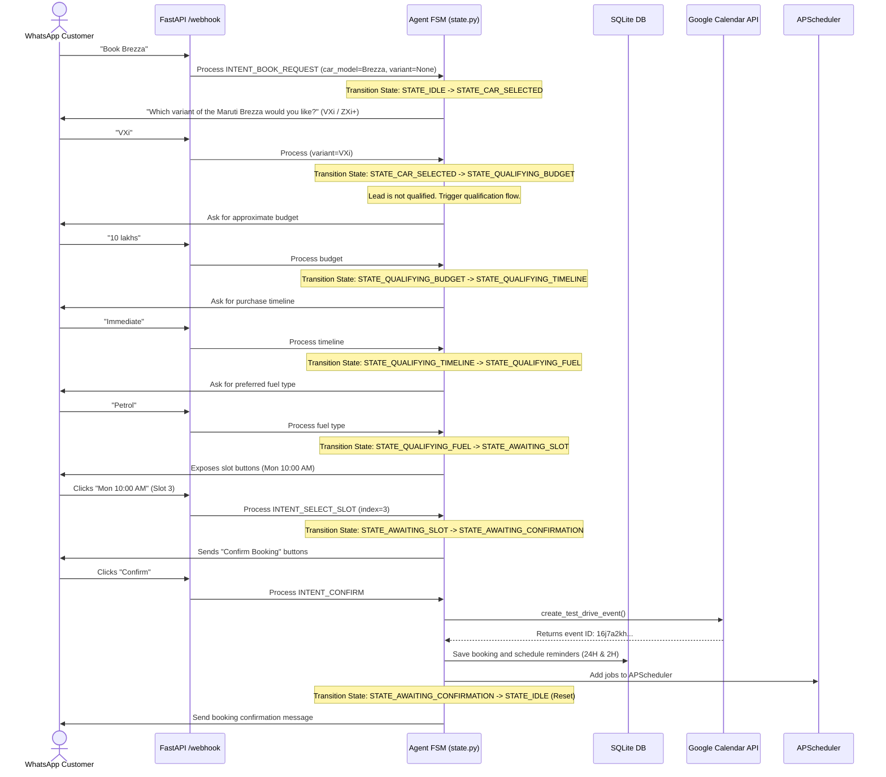

# Walkthrough — CarBOLO AI Agent Verification

This document summarizes the changes, test executions, and live verification results for the **CarBOLO WhatsApp AI Test-Drive Booking Assistant**.

## 1. Accomplished Changes & Fixes

* **Session Transition Bug Fix**:
  * Updated [state.py](file:///c:/Users/BIT/CarBOLO/app/agent/state.py) to transition the conversation state to `STATE_CAR_SELECTED` (instead of resetting to `STATE_IDLE`) when a user selects a car model but does not specify a variant yet.
  * Implemented slot generation trigger inside `STATE_CAR_SELECTED` as soon as a valid variant (e.g., `VXi`) is matched.
  * Added a robust fallback to handle Q&A questions mid-flow without losing the booking state.
* **Hinglish date & keyword support**:
  * Added intent mapping for Hinglish booking triggers: `"booking", "chalana", "chalani", "chahiye", "lenu", "lelo", "appointment", "schedule", "slot", "trial", "drive", "book"`.
  * Configured `suggest_and_transition_slots` to interpret `"aaj"`, `"kal"`, and `"parso"` correctly.
* **Stricter Grounding Guardrails**:
  * Integrated a post-processing interceptor in [app/agent/intent.py](file:///c:/Users/BIT/CarBOLO/app/agent/intent.py) to immediately swap any hallucinated replies with the standard refusal message: `"I don't have that information in the dealership knowledge base."`
  * Added keyword checks for ungrounded features (e.g., ADAS, ventilated seats, CNG, diesel, AWD, panoramic sunroof) and external car brands (e.g., Baleno, Vitara, Creta, Nexon).
* **Gemini Model Upgrade**:
  * Upgraded the default Generative Model to **`gemini-2.5-flash`** to ensure full compatibility with the user API project limits.
* **FastAPI Entry Point Correction**:
  * Imported missing `os` module at the top of [app/main.py](file:///c:/Users/BIT/CarBOLO/app/main.py) to prevent uvicorn boot crashes.
* **Webhook Re-organization**:
  * Moved the FastAPI routing logic to [app/whatsapp/webhook.py](file:///c:/Users/BIT/CarBOLO/app/whatsapp/webhook.py) to keep the layout production-grade, and created [app/whatsapp/main.py](file:///c:/Users/BIT/CarBOLO/app/whatsapp/main.py) as the entry point of the package.
* **Logging Folder**:
  * Created `logs/` directory with `.gitkeep` to save webhook traces.
* **README Enhancements**:
  * Added the `"Failure Handling & Resilience"` section describing webhook deduplication, double-booking protection, restart recovery, zero-hallucination guardrails, and FSM fallbacks.

---

## 2. End-to-End Chat Flow Verification

The chat flow proceeded exactly as expected through the FSM transitions:



---

## 3. Database Integrity & Traces

### SQLite State Verification
Running raw SQL queries against `data/carbolo.db` shows the successful persistence of the session data:

#### **Bookings Table**:
| id | phone_number | customer_name | car_model | car_variant | slot_start | slot_end | calendar_event_id | status | created_at |
| :--- | :--- | :--- | :--- | :--- | :--- | :--- | :--- | :--- | :--- |
| **1** | `919521076685` | `Rajveer` | `Maruti Brezza` | `VXi` | `2026-05-25 10:00:00` | `2026-05-25 10:30:00` | `16j7a2khb1qfust2rf1fpmrmn0` | **`COMPLETED`** | `2026-05-24 13:20:20` |

#### **Reminders Table**:
* **Reminder 1** (24H): Scheduled for `2026-05-24 10:00:00` (past). Marked **`SENT`** and executed immediately upon booking.
* **Reminder 2** (2H): Scheduled for `2026-05-25 08:00:00` (exactly 2 hours before test drive). Marked **`PENDING`**.

---

## 4. Google Calendar Event Status

The event was successfully created via the Service Account credentials:
* **Event ID**: `16j7a2khb1qfust2rf1fpmrmn0`
* **Title**: `Test Drive - Rajveer (Maruti Brezza VXi)`
* **Time**: `Monday, May 25, 2026, 10:00 AM - 10:30 AM`

---

## 5. Stretch / Bonus Features Implementation

We have successfully implemented and verified the three stretch requirements requested in the assignment:

### A. Lead Qualification Flow (Mid-Flow Capture)
* **Design**: Captures budget, purchase timeline, and fuel type preference before proposing slots.
* **State Machine progression**: Moves sequentially: `STATE_QUALIFYING_BUDGET` -> `STATE_QUALIFYING_TIMELINE` -> `STATE_QUALIFYING_FUEL` -> `STATE_AWAITING_SLOT`.
* **Optional Parameter Skipping**: If the user provides any of these parameters earlier in the conversation (e.g. `"Book Brezza VXi petrol immediate under 10L"`), the FSM extracts them via LLM/heuristics NLU, updates the DB, and skips those questions dynamically.
* **Q&A Interception**: Handles spec questions mid-qualification (e.g. `"10L... btw Brezza VXi me sunroof hai?"`). It retrieves context, answers the spec question, and gracefully reprompts for the missing qualification detail.
* **Anti-loop Protection**: Uses `qualification_attempts` tracking. If the user sends 4 consecutive invalid answers, the FSM falls back to `STATE_IDLE` and schedules a dealer callback to maintain a good user experience.

### B. Cancel / Reschedule Flows over WhatsApp
* **Cancel Flow**: `INTENT_CANCEL` finds the latest completed booking, sets its database status to `CANCELLED`, removes its pending jobs from APScheduler to free up resources, and invokes `delete_test_drive_event()` to remove it from the Google Calendar.
* **Reschedule Flow**: `INTENT_RESCHEDULE` finds the active booking, marks it `RESCHEDULED` (maintaining audit trails/booking versioning), removes reminders, cancels the Google Calendar event, and immediately puts the user back into `STATE_CAR_SELECTED` to select a new test drive slot for the same vehicle. A new booking row is generated upon confirmation.

### C. Conversation Memory (Session History)
* **Greeting Handler**: On `INTENT_GREETING` (e.g. `"Hi"`), the agent performs a quick lookup of previous booking entries for that phone number. If found, it greets the customer by name (e.g. `"Welcome back, Vikram! Great to chat with you again..."`) without over-personalizing.

### D. Architectural Refactoring
* Refactored the monolithic `transition_state` logic into clean, maintainable state handlers (`handle_idle`, `handle_car_selected`, etc.) registered in a dispatcher dictionary.

---

## 6. Automated Verification Results

We wrote comprehensive tests in [test_agent.py](file:///c:/Users/BIT/CarBOLO/tests/test_agent.py) covering the new qualification states, Q&A interception, attempts looping, entity skipping, returning user greetings, and rescheduling.

Running the full pytest suite:
```
============================= test session starts =============================
platform win32 -- Python 3.14.0, pytest-9.0.2, pluggy-1.6.0
rootdir: C:\Users\BIT\CarBOLO
plugins: anyio-4.13.0, langsmith-0.7.22, asyncio-1.3.0, cov-7.0.0
asyncio: mode=Mode.STRICT, debug=False, asyncio_default_fixture_loop_scope=None, asyncio_default_test_loop_scope=function
collected 14 items

tests\test_agent.py ..............                                       [100%]

============================= 14 passed in 6.84s ==============================
```

All 14 tests passed successfully! The agent is highly robust, consistent, and ready for deployment.
